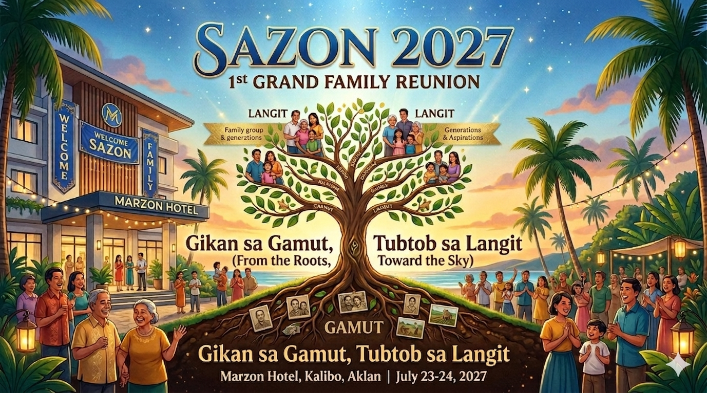
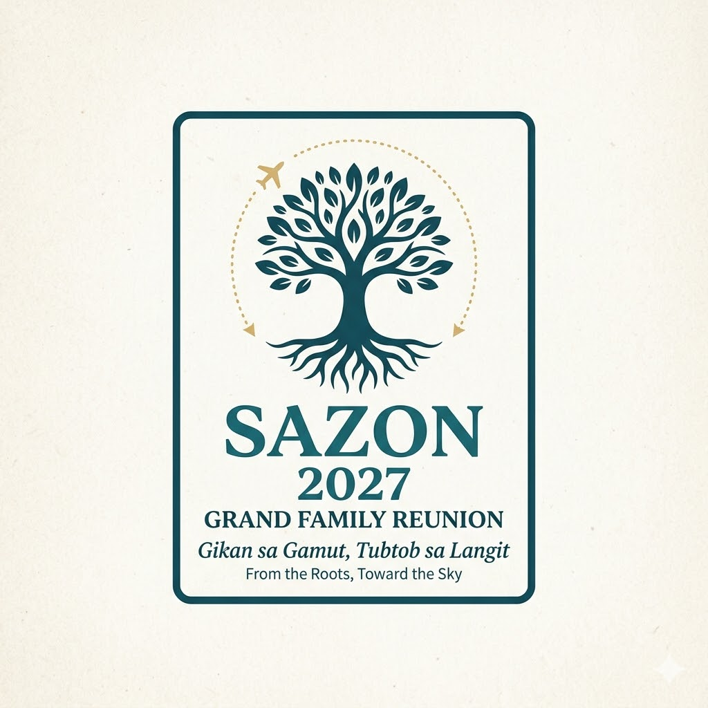

<!DOCTYPE html>
<html lang="en">
<head>
    <meta charset="UTF-8">
    <meta name="viewport" content="width=device-width, initial-scale=1.0">
    <title>Sazon 2027 - Grand Family Reunion</title>
    <link rel="stylesheet" href="styles.css">
    
</head>
<body>
    

        

        
Welcome to Sazon 2027...

    

    

        

            
            

                <h1>🏝️ SAZON 2027 🏝️</h1>
                
1st Edition Grand Family Reunion

                
Gikan sa Gamut, Tubtob sa Langit

            

        

        <nav class="navbar">
            <ul>
                <li><a href="#home">🏠 Home</a></li>
                <li><a href="#details">📅 Details</a></li>
                <li><a href="#attend">✍️ Register</a></li>
                <li><a href="#share">📤 Share</a></li>
            </ul>
        </nav>

        <section id="home" class="section">
            
            <h2>Welcome to Sazon 2027</h2>
            
🎉 Join us for the most awaited Ilonggo family gathering!

            
We are excited to welcome you to the 1st Edition of the Grand Family Reunion. This event celebrates our heritage, strengthens family bonds, and creates lasting memories.

            

                <button class="btn btn-secondary" onclick="playJingle()">🎵 Play Jingle</button>
            

        </section>

        <section id="details" class="section">
            <h2>📅 Event Details</h2>
            

                

                    

                        <h3>📆 Dates</h3>
                        
<strong>July 22-23, 2027</strong>

                    

                

                

                    

                        <h3>📍 Venue</h3>
                        
<strong>Marzon Resort, Kalibo, Aklan</strong>

                    

                

                

                    

                        <h3>🌊 Location</h3>
                        
Near beautiful Boracay Island

                    

                

            

        </section>

        <section id="attend" class="section">
            <h2>✍️ Register Your Attendance</h2>
            <form id="attendanceForm" class="form" onsubmit="submitAttendanceRequest(event)">
                <input type="text" id="attendeeName" placeholder="Full Name" required>
                <input type="email" id="attendeeEmail" placeholder="Email Address" required>
                <input type="tel" id="attendeeContact" placeholder="Contact Number" required>
                <select id="familyBranch" required>
                    <option value="">Select Family Branch</option>
                    <option value="Main Family">Main Family</option>
                    <option value="Northern Branch">Northern Branch</option>
                    <option value="Southern Branch">Southern Branch</option>
                    <option value="Eastern Branch">Eastern Branch</option>
                    <option value="Western Branch">Western Branch</option>
                </select>
                <input type="number" id="numGuests" placeholder="Additional Guests" min="0" value="0">
                <button type="submit" class="btn btn-primary">Submit Registration</button>
            </form>
            

                ✅ Thank you! Your registration is pending approval.
            

        </section>

        <section id="share" class="section">
            <h2>📤 Share & Invite</h2>
            

                <button class="btn btn-primary" onclick="shareWebsite()">📤 Share Website</button>
                <button class="btn btn-secondary" onclick="downloadQRCode()">⬇️ Download QR Code</button>
            

            <h3 style="text-align: center; margin-top: 30px;">QR Code</h3>
            

                

            

        </section>

        <section class="section">
            

                <button class="btn btn-secondary" onclick="toggleAdminPanel()">⚙️ Admin Access</button>
            

            
            

                

                    <h3>🔐 Admin Login</h3>
                    <form onsubmit="adminLogin(event)" style="display: flex; gap: 10px; justify-content: center; flex-wrap: wrap;">
                        <input type="password" id="adminPassword" placeholder="Password" required style="padding: 10px; border: 2px solid #0066cc; border-radius: 5px;">
                        <button type="submit" class="btn btn-primary">Login</button>
                    </form>
                

                
                

                    <button class="btn btn-danger" onclick="adminLogout()" style="float: right;">Logout</button>
                    <h3>📋 Pending Requests</h3>
                    

                    
                    <h3>✅ Approved Attendees</h3>
                    

                

            

        </section>
    

    <footer class="footer">
        
<strong>Sazon 2027 - Grand Family Reunion</strong>

        
"Gikan sa Gamut, Tubtob sa Langit" - From the Roots, Towards the Sky

        
July 22-23, 2027 • Marzon Resort, Kalibo, Aklan

    </footer>

    
</body>
</html>
